# Customer Churn Prediction & CLV Analysis - Project Report

## Mục lục
- [1. Tổng quan dự án](#1-tổng-quan-dự-án)
- [2. Cấu trúc dự án](#2-cấu-trúc-dự-án)
- [3. Dữ liệu](#3-dữ-liệu)
- [4. Notebooks Analysis](#4-notebooks-analysis)
- [5. API System](#5-api-system)

---

## 1. Tổng quan dự án

**Business Context:**
- **Vấn đề**: CAC (Customer Acquisition Cost) tăng cao, Churn cao ở nhóm khách hàng giá trị, Campaign retention gửi đại trà → tốn chi phí, ROI thấp
- **Mục tiêu**: Giảm churn, Tối đa hóa CLV (Customer Lifetime Value), Tránh over-treatment (spam khách hàng không cần giữ)
- **Câu hỏi then chốt**: Nếu ngân sách retention chỉ đủ giữ 20% customer base, chọn 20% nào?

---

## 2. Cấu trúc dự án

```
/home/user/webapp/
├── LICENSE
├── README.md
├── requirements.txt
├── run_api.py                          # Entry point để chạy API server
│
├── data/
│   ├── customers.csv                   # 3,000 customers
│   └── transactions.csv                # 46,704 transactions
│
├── models/
│   ├── bgnbd_model.pkl                 # BG-NBD model 
│   ├── gamma_gamma_model.pkl           # Gamma-Gamma model 
│   ├── cox_ph_model.pkl                # CoxPH 
│   ├── churn_classification_model.pkl  # Logistic Regression
│   ├── churn_calibrated_model.pkl      # Calibrated classifier 
│   ├── preprocessing_pipeline.pkl      # Feature preprocessing 
│   ├── feature_scaler.pkl              # Feature scaler 
│   ├── feature_columns.pkl             # Feature column list 
│   └── cox_features.pkl                # Cox feature names 
│
├── notebooks/
│   ├── customer_churn_clv_analysis.ipynb  # Main analysis 
│   └── EDA.ipynb                          # Exploratory Data Analysis
│
└── src/
    ├── __init__.py
    ├── api_service.py                  # FastAPI endpoints
    ├── models.py                       # Pydantic request/response schemas
    ├── scoring_engine.py               # Core prediction logic
    ├── data_processor.py               # Data loading và feature computation
    ├── model_loader.py                 # Model loading utilities
    ├── feature_engineer.py             # ChurnFeatureEngineer class
    └── coxph_feature_prepation.py      # Cox PH feature preparation
```

---

## 3. Dữ liệu

### 3.1 customers.csv
- **Records**: 3,000 customers
- **Columns**: `customer_id`, `signup_date`, `true_lifetime_days`
- **Date range**: signup_date từ 2025-01-02 đến 2025-12-02
- **True lifetime**: mean=156.77 days, min=30, max=365

### 3.2 transactions.csv
- **Records**: 46,704 transactions
- **Columns**: `customer_id`, `transaction_date`, `amount`
- **Date range**: 2025-01-03 đến 2025-12-31
- **Observation date**: 2026-01-01 (last transaction + 1 day)

---

## 4. Notebooks Analysis

### Tổng quan Notebook: `customer_churn_clv_analysis.ipynb`

**Business Context:**
- **Vấn đề**: CAC (Customer Acquisition Cost) tăng cao, Churn cao ở nhóm khách hàng giá trị, Campaign retention gửi đại trà → tốn chi phí, ROI thấp
- **Mục tiêu**: Giảm churn, Tối đa hóa CLV (Customer Lifetime Value), Tránh over-treatment (spam khách hàng không cần giữ)
- **Câu hỏi then chốt**: Nếu ngân sách retention chỉ đủ giữ 20% customer base, chọn 20% nào?

---

### Part 0: Data Exploration

- Chọn **Observation Date** là 2026-01-01 (last transaction + 1 day)
- Trường `true_lifetime_days` - thông tin về thời gian hoạt động thực tế của khách hàng, trong thực tế thì sẽ không biết trước được thông tin này

#### Transaction Pattern Analysis
Phân tích khoảng cách giữa các lần mua hàng (purchase intervals):
- Mean interval: **6.3 ngày**
- Median interval: **3.0 ngày**
- 75th percentile: **8.0 ngày**
- 90th percentile: **16.0 ngày**
- 95th percentile: **23.0 ngày**

<p align="center">
  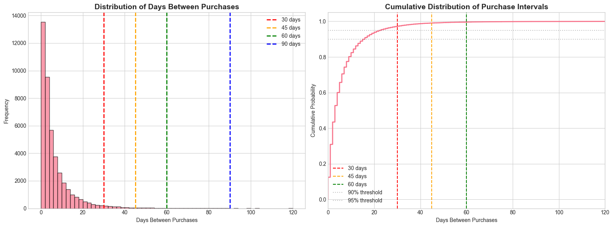
</p>

**→ Insight**: Phần lớn khách hàng mua lại trong vòng 8 ngày, 95% quay lại trong 23 ngày.

---

### Part 1: RFM Analysis & Churn Definition

#### 4.1.1 RFM Metrics Calculation
- Ngoài R, F, M score, tính thêm **RFM_score**: Tổng 3 scores (3-15)

**Customer Segments:**
| Segment | Logic | Mô tả | Số lượng KH |
|---------|-------|-------|:------------:|
| Champions | R≥4, F≥4 | Khách hàng tốt nhất | 718 |
| Loyal | R≥4, F≥2 | Mua thường xuyên |  386 |
| Promising | R≥4, F=1 | Mới mua, tiềm năng | 58 | 
| Potential Loyalist | R=3, F≥3 | Có thể trở thành loyal | 292 |
| New Customers | R=3, F≤2 | Khách hàng mới | 284 |
| At Risk | R=2, F≥3 | Từng tốt, đang giảm | 294 |
| About to Sleep | R=2, F≤2 | Sắp ngủ đông | 288 |
| Cannot Lose Them | R=1, F≥3 | Chi tiêu cao nhưng có rủi ro | 191 | 
| Hibernating | R=1, F≤2 | Không hoạt động | 381 | 

**Kết quả Segmentation:**
- High-Value Customers (RFM≥12): ~21.9%
- At-Risk Customers: ~39.9%

<p align="center">
  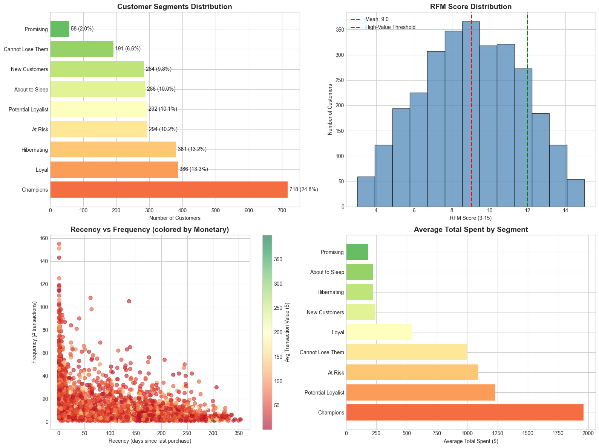
</p>

**Churn rate by segment:**
<p align="center">
  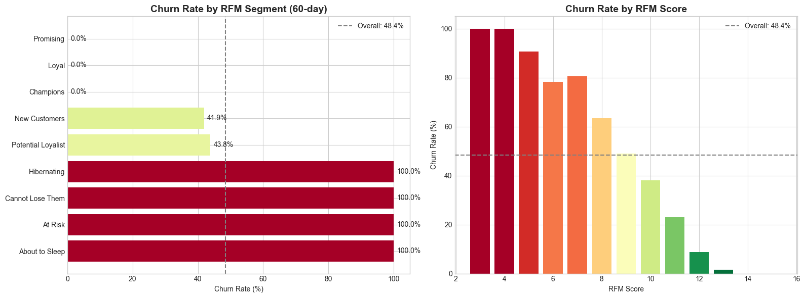
</p>

#### 4.1.3 Churn Definition
**Phương pháp**: Inactivity Window - khách hàng được coi là CHURN nếu không có giao dịch trong khoảng thời gian nhất định.

**So sánh các window:**
<p align="center">
  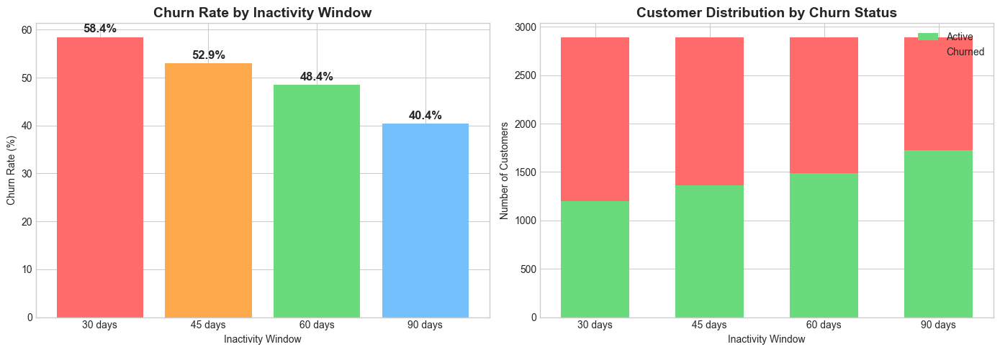
</p>

**Lựa chọn: 60-day inactivity window** vì:
- 30 ngày: False Positive cao (nhiều người chỉ đơn giản ít sử dụng)
- 90 ngày: Quá trễ, khó lôi kéo khách quay lại
- 60 ngày: Cân bằng giữa precision và actionability. Ta thấy điểm gãy, từ 30 lên 45 ngày, tỷ lệ churn giảm mạnh (~6%). Từ 60 lên 90 ngày, tỷ lệ giảm tiếp ~8%.

---

### Part 2: Churn Prediction as Classification

#### 4.2.1 Các vấn đề
- Nếu đưa các khách hàng đã churn vào train dataset thì sẽ bị data leakage, model không thể generalize trên unseen data.

**Giải pháp:**
1. **Tách windows**: `churn_window=90` (định nghĩa active), `prediction_window=60` (dự báo)
2. **Filtering**: Chỉ giữ customers có `recency < churn_window`
3. **Label đúng**: Label = 1 nếu KHÔNG có giao dịch trong horizon
4. **Sliding Window approach**: Training data từ nhiều snapshots (tháng 3-9/2025)

<p align="center">
  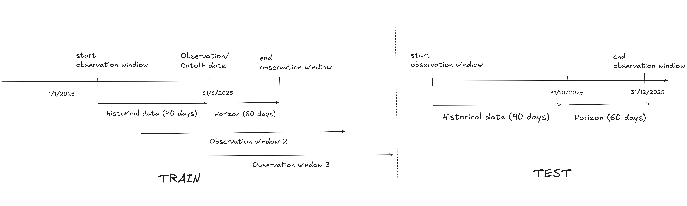
</p>

#### 4.2.2 Feature Engineering
**Parameters:**
- Historical Window: 90 days (dữ liệu quá khứ để tính features)
- Horizon: 60 days (cửa sổ dự báo)
- Training snapshots: 7 cutoff dates (cuối tháng 3-9/2025)
- Test snapshot: 31/10/2025

**Feature Columns (19 features):**
- Basic: `recency`, `frequency`, `monetary`, `customer_age_days`, `total_spent`
- RFM: `R_score`, `F_score`, `M_score`, `RFM_score`
- Derived: `days_between_purchases`, `purchase_frequency_rate`
- Relative: `recency_to_tenure_ratio`, `recent_frequency_ratio`
- Recent behavior: `recent_30d_frequency`, `recent_30d_monetary`, `recent_30d_spend`
- Flags: `is_high_value`, `is_at_risk`
- Trend: `frequency_trend`

#### 4.2.3 Model Training & Evaluation
**Preprocessing Pipeline:**
- SimpleImputer (fill_value=0)
- StandardScaler

**Models trained:**
| Model | ROC-AUC | PR-AUC | Brier Score |
|-------|---------|--------|-------------|
| **Logistic Regression** | 0.8432 | **0.7460** | 0.1547 |
| Random Forest | 0.8447 | 0.7380 | 0.1407 |
| Gradient Boosting | 0.8363 | 0.7263 | 0.1375 |

<p align="center">
  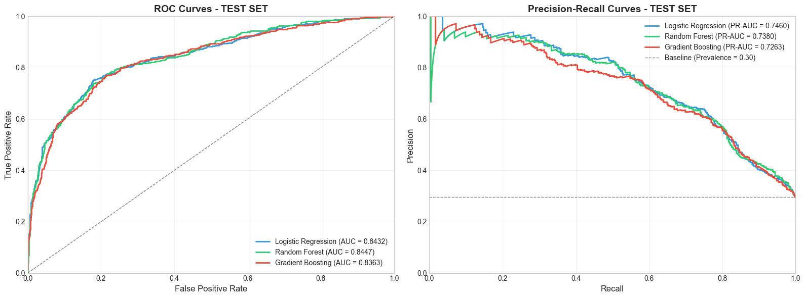
</p>

**Best Model: Logistic Regression** với PR-AUC cao nhất (0.7460).

#### 4.2.4 Model Calibration (Platt Scaling)

<p align="center">
  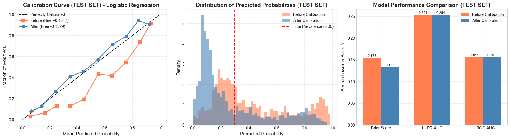
</p>

#### 4.2.5 Feature Importance (Logistic Regression)
<p align="center">
  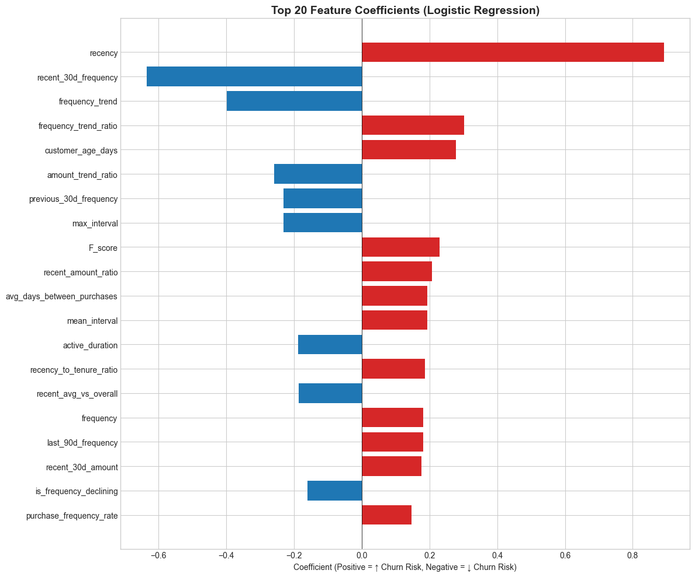
</p>

#### 4.2.6 Churn Risk Segmentation
Phân khúc khách hàng theo churn probability:
| Segment | Probability Range | Description |
|---------|-------------------|-------------|
| Low Risk | <0.3 | An toàn |
| Medium Risk | 0.3-0.5 | Cần theo dõi |
| High Risk | 0.5-0.7 | Cần can thiệp |
| Critical Risk | >0.7 | Khẩn cấp |

---

### Part 3: BG-NBD Probability Model

#### 4.3.1 Model Overview
**BG-NBD (Beta-Geometric/Negative Binomial Distribution):**
- Mô hình xác suất cho non-contractual business
- Dự đoán: P(alive) và Expected purchases trong tương lai

#### 4.3.2 Data Preparation
Sử dụng `summary_data_from_transaction_data` từ lifetimes:
- Input: transactions với customer_id, transaction_date, amount
- Output: frequency, recency, T, monetary_value cho mỗi customer

#### 4.3.3 Model Fitting
```
bgf = BetaGeoFitter(penalizer_coef=0.01)
bgf.fit(frequency, recency, T)
```

**Model Parameters:**
- r, α (purchase rate parameters)
- a, b (dropout probability parameters)

#### 4.3.4 Predictions
**P(Alive):** Xác suất khách hàng vẫn còn "sống" (sẽ mua lại)
```python
p_alive = bgf.conditional_probability_alive(frequency, recency, T)
```

**Expected Purchases:**
```python
expected_purchases = bgf.conditional_expected_number_of_purchases_up_to_time(
    days, frequency, recency, T
)
```

<p align="center">
  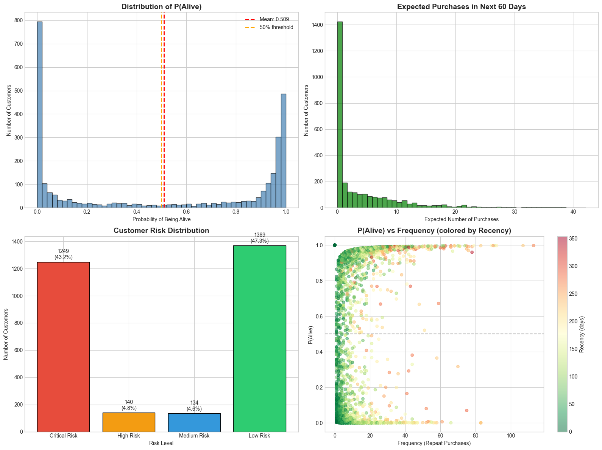
</p>

#### 4.3.5 P(Alive) Timeline Visualization
Minh họa P(Alive) thay đổi theo thời gian cho 2 loại khách hàng:
- **High-Frequency Customer**: P(Alive) tăng sau mỗi giao dịch, giảm khi không mua
- **Low-Frequency Customer**: P(Alive) decay chậm hơn vì kỳ vọng mua không thường xuyên

<p align="center">
  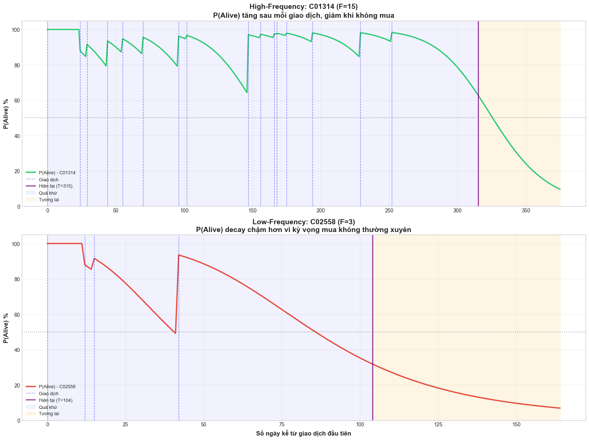
</p>

#### 4.3.6 Risk Distribution
Phân loại risk level dựa trên P(alive):
| Risk Level | P(alive) Range |
|------------|----------------|
| Critical Risk | 0-0.3 |
| High Risk | 0.3-0.5 |
| Medium Risk | 0.5-0.7 |
| Low Risk | 0.7-1.0 |

#### 4.3.7 BG-NBD vs Ground Truth
So sánh prediction với actual churn:
- Threshold: P(alive) < 0.5 → Churned
- Metrics: Accuracy, ROC-AUC trên cả train và test set

---

### Part 4: Survival Analysis (CoxPH)

#### 4.4.1 Survival Data Preparation
Chuẩn bị data cho survival analysis:
- **Duration**: Số ngày từ signup đến observation date (hoặc churn date)
- **Event**: 1 nếu đã churn, 0 nếu censored (còn active)
- Merge với customer features từ Part 2

#### 4.4.2 Cox PH Model
**Features cho Cox model:**
- RFM metrics: `recency`, `frequency`, `monetary`, `RFM_score`
- Behavior: `purchase_frequency_rate`, `recent_30d_frequency`
- Flags: `is_high_value`, `is_at_risk`

**Model Fitting:**
```python
cph = CoxPHFitter(penalizer=0.01)
cph.fit(cox_data, duration_col='duration', event_col='event')
```

**Performance: Concordance Index = 0.6873**

#### 4.4.3 Hazard Ratios Interpretation

<p align="center">
  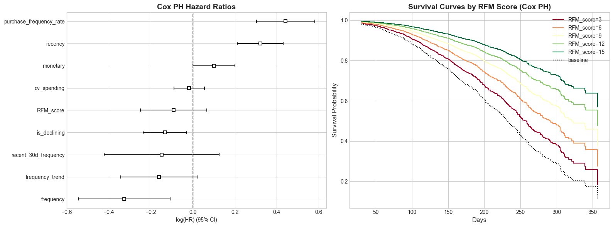
</p>

| Feature | Hazard Ratio | Interpretation |
|---------|--------------|----------------|
| purchase_frequency_rate | **1.56** | Tăng → 56% higher churn risk |
| recency | **1.38** | Tăng → 38% higher churn risk |
| monetary | **1.11** | Tăng → 11% higher churn risk |
| frequency | **0.72** | Tăng → 28% lower churn risk |
| is_declining | **0.88** | Flag = 1 → 12% lower churn risk |

**→ Insight**: `purchase_frequency_rate` và `recency` là predictors mạnh nhất của churn (p < 0.001).

#### 4.4.4 Survival Predictions
**Predictions cho mỗi customer:**
- `median_survival_time`: Thời điểm 50% survival probability
- `expected_remaining_lifetime`: median - duration (nếu > 0)
- `survival_prob_Xd`: Xác suất survival tại ngày X (30, 60, 90, 180)
- `churn_risk_Xd`: 1 - survival_prob

### Part 5: CLV Modeling

#### 4.5.1 Approach 1: BG-NBD + Gamma-Gamma

**Gamma-Gamma Model:**
- Dự đoán Expected monetary value per transaction
- Yêu cầu: frequency > 0, monetary_value > 0
- Assumption: Low correlation giữa frequency và monetary

**Model Fitting:**
```python
ggf = GammaGammaFitter(penalizer_coef=0.01)
ggf.fit(frequency, monetary_value)
```

**CLV Formula:**
```
CLV = E[transactions in T] × E[profit per transaction] × discount_factor
```

**Parameters:**
- Time horizons: 6, 12, 24 months
- Monthly discount rate: 1% (~12% annually)

**CLV Calculation:**
```python
clv = ggf.customer_lifetime_value(
    bgf, frequency, recency, T, monetary_value,
    time=months, discount_rate=0.01
)
```

<p align="center">
  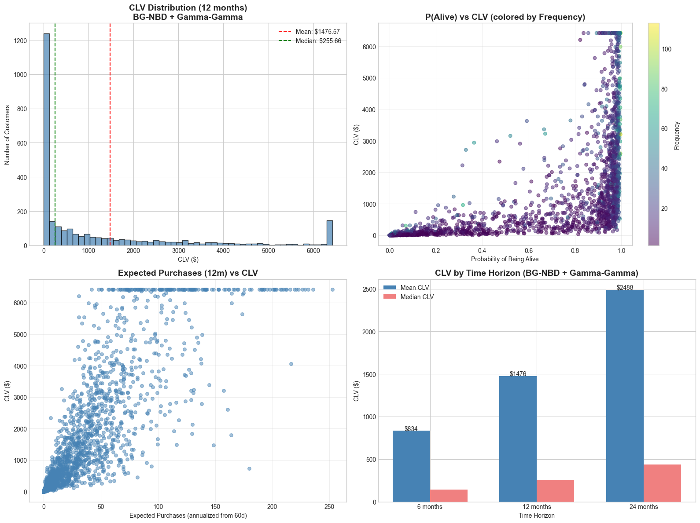
</p>

#### 4.5.2 Approach 2: Survival Analysis + Gamma-Gamma

**Time-dependent CLV Formula:**
```
CLV(T) = Σ E[profit_t] × S(t) × discount_factor(t)
```

Where:
- E[profit_t]: Expected profit at time t (từ Gamma-Gamma)
- S(t): Survival probability at time t (từ Cox PH)
- discount_factor(t): (1 + r)^(-t)

#### 4.5.3 CLV Comparison
- Correlation giữa BG-NBD CLV và Survival CLV: **0.9788**
- Hai approach cho kết quả tương đồng
- BG-NBD approach đơn giản hơn, Survival approach linh hoạt hơn với features

<p align="center">
  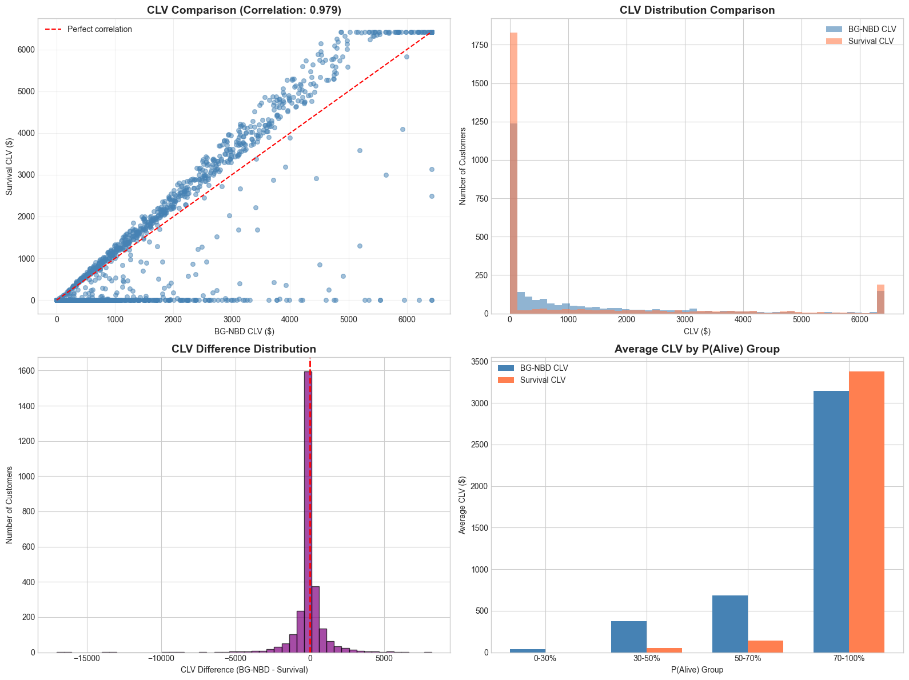
</p>

---

### Part 6: Retention Strategy Comparison

#### 4.6.1 Business Scenario
- **Budget constraint**: Chỉ đủ giữ 20% customer base
- **Target**: 314 customers (20% của 1,574 test set customers)

#### 4.6.2 Three Strategies Defined

**Strategy 1: High Churn Probability (Classification)**
- Target: Top 20% highest `churn_probability_classification`
- Logic: Nhắm vào những người có xác suất churn cao nhất

**Strategy 2: Low P(alive) (BG-NBD)**
- Target: Bottom 20% `p_alive`
- Logic: Nhắm vào những người có xác suất "sống" thấp nhất

**Strategy 3: CLV × Risk (Value-weighted)**
- Target: Top 20% `clv_bgnbd_12m × churn_risk_60d`
- Logic: Cân bằng giữa churn risk và customer value

#### 4.6.3 Strategy Evaluation Metrics
| Metric | S1: Churn Prob | S2: P(alive) | S3: CLV×Risk |
|--------|----------------|--------------|--------------|
| Num Customers | 314 | 314 | 314 |
| Actual Churn Rate | **41.7%** | 85.0% | 0.0% |
| Avg CLV | **$1,864** | $35.20 | $3,586 |
| Total CLV at Risk | **$585,186** | $11,053 | $1,126,117 |
| High-Value % | **34.4%** | 15.0% | 44.0% |
| Avg Total Spent | $712 | $566 | $784 |

#### 4.6.4 Strategy Overlap Analysis

<p align="center">
  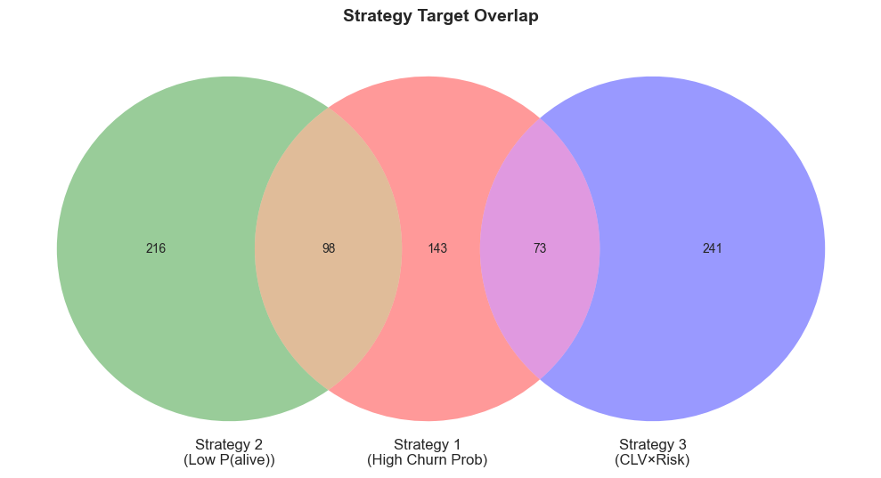
</p>

- **→ Insight**: Strategy 2 và Strategy 3 không có overlap - nhắm vào nhóm hoàn toàn khác nhau

#### 4.6.5 ROI Analysis
**Assumptions:**
- Campaign cost per customer: $50
- Expected retention success rate: 30%

| Strategy | Total Cost | Expected Retained | CLV Saved | Net Value | ROI |
|----------|------------|-------------------|-----------|-----------|-----|
| **S1: Churn Prob** | $15,700 | 39.3 | $73,241 | **+$57,541** | **+366.5%** |
| S2: P(alive) | $15,700 | 80.1 | $2,820 | -$12,880 | -82.0% |
| S3: CLV×Risk | $15,700 | 0.0 | $0 | -$15,700 | -100.0% |

#### 4.6.6 Key Insights

**Strategy 1 thành công vì:**
- Actual churn rate vừa phải (41.7%) với avg CLV cao ($1,864)
- Total CLV at Risk: $585,186
- 34.4% là High-Value customers
- **ROI +366.5%** - cao nhất trong 3 strategies

**Strategy 2 & 3 thất bại vì:**
- Strategy 2: Churn rate cao (85%) nhưng CLV rất thấp ($35) → không đủ cover campaign cost
- Strategy 3: Actual churn rate = 0% → không có ai thực sự churn để retain → ROI = -100%

---

### Part 7: Model Serialization

- Models Saved:

| File | Model | 
|------|-------|
| `churn_classification_model.pkl` | Logistic Regression |
| `churn_calibrated_model.pkl` | Calibrated classifier |
| `bgnbd_model.pkl` | BG-NBD (lifetimes) | 
| `gamma_gamma_model.pkl` | Gamma-Gamma (lifetimes) | 
| `cox_ph_model.pkl` | Cox PH (lifelines) | 
| `preprocessing_pipeline.pkl` | Imputer + Scaler | 
| `feature_columns.pkl` | Feature list | 
| `cox_features.pkl` | Cox feature names | 


---

## 5. API System

- API Endpoints Summary:

| Endpoint | Method | Input | Output |
|----------|--------|-------|--------|
| `/` | GET | - | API info |
| `/health` | GET | - | Health status |
| `/score_customer` | POST | `{customer_id}` | Full metrics |
| `/predict_churn` | POST | `{customer_id, horizon_days}` | Churn probability + label |
| `/predict_survival` | POST | `{customer_id}` | Survival curve + lifetime |
| `/estimate_clv` | POST | `{customer_id, method, horizon}` | CLV value |
| `/rank_customers_for_retention` | POST | `{top_k, strategy}` | Ranked customers |

- Running the API:

```bash
# Option 1: Using run_api.py
cd /home/user/webapp
python run_api.py --host 127.0.0.1 --port 8000

# Option 2: Using uvicorn directly
cd /home/user/webapp
uvicorn src.api_service:app --host 127.0.0.1 --port 8000 --reload

# Access API documentation
# Swagger UI: http://localhost:8000/docs
# ReDoc: http://localhost:8000/redoc
# OpenAPI JSON: http://localhost:8000/openapi.json
```

- Error Handling: 

| Status Code | Error Type | Description |
|-------------|------------|-------------|
| 200 | Success | Request processed successfully |
| 404 | CustomerNotFoundError | Customer ID not found in database |
| 500 | Internal Server Error | Calculation failed |


### 5.1 Kiến trúc tổng quan

```
┌─────────────────────────────────────────────────────────────────────────────┐
│                         Customer Churn & CLV API                            │
│                         /home/user/webapp/run_api.py                        │
└─────────────────────────────────────────────────────────────────────────────┘
                                      │
                                      ▼
┌─────────────────────────────────────────────────────────────────────────────┐
│                              FastAPI Application                            │
│                         /home/user/webapp/src/api_service.py                │
│  ┌─────────────────────────────────────────────────────────────────────┐   │
│  │                          Lifespan Handler                            │   │
│  │  • Startup: Load models (ModelLoader) + Load data (DataProcessor)   │   │
│  │  • Shutdown: Reset all singletons                                   │   │
│  └─────────────────────────────────────────────────────────────────────┘   │
│  ┌─────────────────────────────────────────────────────────────────────┐   │
│  │                          CORS Middleware                             │   │
│  │  • allow_origins=["*"], allow_methods=["*"], allow_headers=["*"]    │   │
│  └─────────────────────────────────────────────────────────────────────┘   │
└─────────────────────────────────────────────────────────────────────────────┘
                                      │
          ┌───────────────────────────┼───────────────────────────┐
          ▼                           ▼                           ▼
┌──────────────────┐     ┌──────────────────────┐     ┌──────────────────────┐
│   ModelLoader    │     │    DataProcessor     │     │   ScoringEngine      │
│   (Singleton)    │     │     (Singleton)      │     │   (Per-request)      │
│                  │     │                      │     │                      │
│ • BGF model      │     │ • customers.csv      │     │ • Churn prediction   │
│ • GGF model      │     │ • transactions.csv   │     │ • Survival curves    │
│ • Cox PH model   │     │ • Pre-computed feats │     │ • CLV estimation     │
│ • Classification │     │ • On-the-fly feats   │     │ • Customer ranking   │
│ • Preprocessing  │     │ • RFM computation    │     │                      │
└──────────────────┘     └──────────────────────┘     └──────────────────────┘
         │                         │                           │
         └─────────────────────────┼───────────────────────────┘
                                   ▼
                    ┌──────────────────────────┐
                    │   /home/user/webapp/     │
                    │   models/ & data/        │
                    └──────────────────────────┘
```

### 5.2 Chi tiết các Endpoints

#### 5.2.1 Health Check

| Endpoint | Method | Path |
|----------|--------|------|
| Root | GET | `/` |
| Health | GET | `/health` |

**Root Response:**
```json
{
  "message": "🚀 Customer Churn & CLV API",
  "version": "1.0.0",
  "docs": "/docs",
  "health": "/health",
  "endpoints": [
    "POST /score_customer",
    "POST /predict_churn",
    "POST /predict_survival",
    "POST /estimate_clv",
    "POST /rank_customers_for_retention"
  ]
}
```

**Health Response:**
```json
{
  "status": "healthy",
  "models_loaded": {
    "classification": true,
    "bgf": true,
    "ggf": true,
    "cph": true
  },
  "data_loaded": {
    "customers": true,
    "transactions": true,
    "customer_count": 3000
  },
  "all_ready": true
}
```

---

#### 5.2.2 POST /score_customer

**Mô tả:** Unified customer scoring - kết hợp tất cả các metrics trong một request.

**File:** `/home/user/webapp/src/api_service.py` (line 176-221)

**Request Schema:** (`ScoreCustomerRequest`)
```json
{
  "customer_id": "C00001"  // required, string
}
```

**Response Schema:** (`ScoreCustomerResponse`)
```json
{
  "customer_id": "C00001",
  "churn_probability": 0.1234,           // 0-1, từ Classification model
  "p_alive": 0.8765,                      // 0-1, từ BG-NBD model
  "expected_remaining_lifetime": 57.42,   // days, từ Cox PH model
  "clv_bgnbd": 1234.56,                   // $, từ BG-NBD + Gamma-Gamma
  "clv_survival": 987.65                  // $, từ Survival Analysis
}
```

**Logic Flow:**
```
┌─────────────────┐
│ score_customer  │
└────────┬────────┘
         │
         ▼
┌─────────────────────────┐
│ Check customer exists   │
│ (DataProcessor)         │
└────────┬────────────────┘
         │
         ▼
┌─────────────────────────┐     ┌─────────────────────┐
│ is_customer_active()?   │──No─►│ Churned Customer    │
│ (recency < 60 days)     │      │ • churn_prob = 1.0  │
└────────┬────────────────┘      │ • Cox on-the-fly    │
         │Yes                    └─────────────────────┘
         ▼
┌─────────────────────────┐
│ Active Customer         │
│ • Use pre-computed feats│
│ • Classification model  │
│ • Cox PH with features  │
└─────────────────────────┘
         │
         ▼
┌─────────────────────────┐
│ BG-NBD & Gamma-Gamma    │
│ • P(alive)              │
│ • CLV computation       │
│ (Works for ALL customers│
│  with RFM features)     │
└─────────────────────────┘
```

---

#### 5.2.3 POST /predict_churn

**Mô tả:** Dự đoán xác suất churn với risk label.

**File:** `/home/user/webapp/src/api_service.py` (line 224-261)

**Request Schema:** (`PredictChurnRequest`)
```json
{
  "customer_id": "C00001",    // required
  "horizon_days": 60          // optional, default=60, range 1-365
}
```

**Response Schema:** (`PredictChurnResponse`)
```json
{
  "customer_id": "C00001",
  "churn_probability": 0.45,
  "churn_label": "medium_risk"  // enum: low_risk, medium_risk, high_risk, critical_risk
}
```

**Risk Label Thresholds:**
| Probability | Label |
|-------------|-------|
| < 0.3 | `low_risk` |
| 0.3 - 0.5 | `medium_risk` |
| 0.5 - 0.7 | `high_risk` |
| ≥ 0.7 | `critical_risk` |

**Horizon Adjustment:** Nếu `horizon_days != 60`, probability được điều chỉnh:
```python
churn_prob = min(1.0, churn_prob * (horizon_days / 60))
```

---

#### 5.2.4 POST /predict_survival

**Mô tả:** Dự đoán survival curve và expected remaining lifetime.

**File:** `/home/user/webapp/src/api_service.py` (line 264-301)

**Request Schema:** (`PredictSurvivalRequest`)
```json
{
  "customer_id": "C00001"  // required
}
```

**Response Schema:** (`PredictSurvivalResponse`)
```json
{
  "customer_id": "C00001",
  "survival_curve": [
    {"day": 30, "prob": 0.7088},
    {"day": 60, "prob": 0.5024},
    {"day": 90, "prob": 0.3561},
    {"day": 180, "prob": 0.1267},
    {"day": 365, "prob": 0.0160}
  ],
  "expected_remaining_lifetime": 57.42
}
```

**On-the-fly Cox Feature Computation:**
```
┌─────────────────────────────────────────────────────────────────────────────┐
│                    ON-THE-FLY COX FEATURE COMPUTATION                        │
│                    (For ALL customers, not just active)                      │
└─────────────────────────────────────────────────────────────────────────────┘

┌─────────────────┐
│ API Request     │
│ predict_survival│
└────────┬────────┘
         │
         ▼
┌─────────────────────────────────────────────┐
│ compute_cox_features_onthefly(customer_id)  │
│ DataProcessor.py                             │
│                                              │
│ 1. Get customer transactions                 │
│ 2. Compute RFM features from raw data        │
│ 3. Build Cox feature DataFrame               │
│    • recency, frequency, monetary            │
│    • RFM_score, purchase_frequency_rate      │
│    • recent_30d_frequency, frequency_trend   │
│    • is_declining, cv_spending               │
└─────────────────────────────────────────────┘
         │
         ▼
┌─────────────────────────────────────────────┐
│ Cox PH Prediction                            │
│ ScoringEngine.py                             │
│                                              │
│ • cph.predict_survival_function(X_cox)      │
│ • cph.predict_median(X_cox)                 │
│ • Handle DataFrame/scalar return types       │
└─────────────────────────────────────────────┘
         │
         ▼
┌─────────────────────────────────────────────┐
│ Result                                       │
│ • survival_curve: [{day, prob}, ...]        │
│ • expected_remaining_lifetime: float (days) │
│ • NO fallback to default values             │
└─────────────────────────────────────────────┘
```

**Cox Features (from `/home/user/webapp/models/cox_features.pkl`):**
- `recency`
- `frequency`
- `monetary`
- `RFM_score`
- `purchase_frequency_rate`
- `recent_30d_frequency`
- `frequency_trend`
- `is_declining`
- `cv_spending`

---

#### 5.2.5 POST /estimate_clv

**Mô tả:** Ước tính Customer Lifetime Value với 2 phương pháp.

**File:** `/home/user/webapp/src/api_service.py` (line 304-345)

**Request Schema:** (`EstimateCLVRequest`)
```json
{
  "customer_id": "C00001",     // required
  "method": "bgnbd",           // optional, enum: "bgnbd", "survival"
  "horizon_months": 12         // optional, default=12, range 1-36
}
```

**Response Schema:** (`EstimateCLVResponse`)
```json
{
  "customer_id": "C00001",
  "method": "bgnbd",
  "clv": 1234.56,
  "horizon_months": 12
}
```

**CLV Methods:**

| Method | Models Used | Description |
|--------|-------------|-------------|
| `bgnbd` | BG-NBD + Gamma-Gamma | Probabilistic approach, works for ALL customers |
| `survival` | Cox PH + Gamma-Gamma | Survival-weighted CLV |

**BG-NBD CLV Formula:**
```python
clv = ggf.customer_lifetime_value(
    bgf,
    frequency,
    recency,
    T,
    monetary_value,
    time=horizon_months,
    discount_rate=0.01  # Monthly discount rate
)
```

**Survival CLV Formula:**
```python
# Get average survival probability over horizon
surv_probs = cph.predict_survival_function(X_cox, times=time_points)
avg_survival = surv_probs.values.mean()

# Discount factor
discount_factor = (1 - (1 + 0.01)^(-horizon_months)) / 0.01

# CLV
clv = expected_profit * monthly_purchases * avg_survival * discount_factor
```

---

#### 5.2.6 POST /rank_customers_for_retention

**Mô tả:** Xếp hạng khách hàng cho chiến dịch retention.

**File:** `/home/user/webapp/src/api_service.py` (line 348-382)

**Request Schema:** (`RankCustomersRequest`)
```json
{
  "top_k": 100,                     // optional, default=100, range 1-10000
  "strategy": "high_clv_high_churn" // optional, enum
}
```

**Response Schema:** (`RankCustomersResponse`)
```json
{
  "strategy": "high_clv_high_churn",
  "total_customers": 3000,
  "customers": [
    {
      "customer_id": "C00123",
      "churn_probability": 0.78,
      "clv": 5432.10,
      "priority_score": 0.89
    },
    // ... more customers
  ]
}
```

**Retention Strategies:**

| Strategy | Formula | Use Case |
|----------|---------|----------|
| `high_clv_high_churn` | `clv_normalized × churn_prob` | Khách hàng giá trị cao có nguy cơ rời bỏ |
| `high_churn` | `churn_prob` | Tập trung vào nguy cơ churn cao nhất |
| `low_p_alive` | `churn_prob` (≈ 1 - p_alive) | Khách hàng có P(alive) thấp |

---

### 5.3 Pydantic Models

**File:** `/home/user/webapp/src/models.py`

```
┌──────────────────────────────────────────────────────────────────┐
│                           ENUMS                                   │
├──────────────────────────────────────────────────────────────────┤
│ CLVMethod          │ BGNBD, SURVIVAL                             │
│ RetentionStrategy  │ HIGH_CLV_HIGH_CHURN, HIGH_CHURN, LOW_P_ALIVE│
│ ChurnRiskLabel     │ LOW_RISK, MEDIUM_RISK, HIGH_RISK, CRITICAL  │
└──────────────────────────────────────────────────────────────────┘

┌──────────────────────────────────────────────────────────────────┐
│                      REQUEST MODELS                               │
├──────────────────────────────────────────────────────────────────┤
│ ScoreCustomerRequest    │ customer_id: str                       │
│ PredictChurnRequest     │ customer_id, horizon_days (1-365)      │
│ PredictSurvivalRequest  │ customer_id: str                       │
│ EstimateCLVRequest      │ customer_id, method, horizon_months    │
│ RankCustomersRequest    │ top_k (1-10000), strategy              │
└──────────────────────────────────────────────────────────────────┘

┌──────────────────────────────────────────────────────────────────┐
│                      RESPONSE MODELS                              │
├──────────────────────────────────────────────────────────────────┤
│ SurvivalPoint           │ day: int, prob: float                  │
│ ScoreCustomerResponse   │ Full customer metrics                  │
│ PredictChurnResponse    │ probability + risk label               │
│ PredictSurvivalResponse │ survival_curve + lifetime              │
│ EstimateCLVResponse     │ method, clv, horizon                   │
│ RankedCustomer          │ customer_id, churn_prob, clv, score    │
│ RankCustomersResponse   │ strategy, total, customers list        │
└──────────────────────────────────────────────────────────────────┘

┌──────────────────────────────────────────────────────────────────┐
│                       ERROR MODELS                                │
├──────────────────────────────────────────────────────────────────┤
│ ErrorResponse           │ error: str, detail: Optional[str]      │
│ CustomerNotFoundError   │ error="customer_not_found", customer_id│
└──────────────────────────────────────────────────────────────────┘
```

---

### 5.4 Core Modules

#### 5.4.1 ScoringEngine (`/home/user/webapp/src/scoring_engine.py`)

**Class:** `ScoringEngine`

**Default Parameters:**
- `DISCOUNT_RATE = 0.01` (monthly)
- `DEFAULT_HORIZON_MONTHS = 12`
- `SURVIVAL_TIME_POINTS = [30, 60, 90, 180, 365]`

**Key Methods:**

| Method | Description |
|--------|-------------|
| `score_customer(customer_id)` | Unified scoring - returns CustomerScore |
| `predict_churn(customer_id, horizon_days)` | Classification-based churn |
| `predict_survival_curve(customer_id)` | Cox PH survival curve |
| `estimate_clv(customer_id, method, horizon)` | CLV estimation |
| `rank_customers_for_retention(top_k, strategy)` | Retention ranking |

**Internal Methods:**
- `_predict_churn_classification()` - Classification model prediction
- `_predict_p_alive()` - BG-NBD P(alive)
- `_predict_remaining_lifetime()` - Cox PH remaining lifetime
- `_predict_remaining_lifetime_from_cox()` - On-the-fly Cox prediction
- `_calculate_bgnbd_clv()` - BG-NBD CLV calculation
- `_calculate_survival_clv()` - Survival-based CLV
- `_get_churn_label()` - Convert probability to risk label

#### 5.4.2 DataProcessor (`/home/user/webapp/src/data_processor.py`)

**File:** `/home/user/webapp/src/data_processor.py`

**Default Configuration:**
- `DEFAULT_DATA_DIR = 'data'`
- `DEFAULT_OBSERVATION_DATE = '2026-01-01'`

**Key Methods:**

| Method | Description |
|--------|-------------|
| `load_data()` | Load customers.csv và transactions.csv |
| `customer_exists(customer_id)` | Check if customer exists |
| `is_customer_active(customer_id)` | Check if recency < 60 days |
| `compute_rfm_features(customer_id)` | Compute RFM on-the-fly |
| `compute_cox_features_onthefly(customer_id)` | Compute Cox features on-the-fly |
| `compute_all_features(customer_id)` | Get all features (pre-computed or default) |
| `get_all_customer_ids()` | Get list of all customer IDs |

**Pre-computed vs On-the-fly Features:**
```
┌─────────────────────────────────────────────────────────────────────┐
│                    Feature Computation Strategy                     │
└─────────────────────────────────────────────────────────────────────┘

┌─────────────────────┐     ┌─────────────────────────────────────────┐
│ Active Customers    │     │ Pre-computed features                   │
│ (recency < 60 days) │────►│ • Loaded at startup via ChurnFeatureEng │
│                     │     │ • Fast lookup in self.all_features      │
└─────────────────────┘     └─────────────────────────────────────────┘

┌─────────────────────┐     ┌─────────────────────────────────────────┐
│ Churned Customers   │     │ On-the-fly computation                  │
│ (recency >= 60 days)│────►│ • compute_rfm_features()                │
│                     │     │ • compute_cox_features_onthefly()       │
└─────────────────────┘     └─────────────────────────────────────────┘
```

#### 5.4.3 ModelLoader (`/home/user/webapp/src/model_loader.py`)

**File:** `/home/user/webapp/src/model_loader.py`

**Models Loaded:**

| Model | File | Loader |
|-------|------|--------|
| BG-NBD | `bgnbd_model.pkl` | dill |
| Gamma-Gamma | `gamma_gamma_model.pkl` | dill |
| Cox PH | `cox_ph_model.pkl` | pickle |
| Classification | `churn_classification_model.pkl` | pickle |
| Calibrated | `churn_calibrated_model.pkl` | pickle |
| Preprocessing | `preprocessing_pipeline.pkl` | pickle |
| Feature Scaler | `feature_scaler.pkl` | pickle |
| Feature Columns | `feature_columns.pkl` | pickle |
| Cox Features | `cox_features.pkl` | pickle |

**Singleton Pattern:**
```python
_loader_instance = None

def get_model_loader() -> ModelLoader:
    global _loader_instance
    if _loader_instance is None:
        _loader_instance = ModelLoader()
        _loader_instance.load_all_models()
    return _loader_instance
```

---

### 5.5 API Data Flow Diagram

```
┌──────────────────────────────────────────────────────────────────────────────┐
│                              API REQUEST FLOW                                 │
└──────────────────────────────────────────────────────────────────────────────┘

          Client Request                    Server Processing
          ──────────────                    ─────────────────

    ┌─────────────────┐
    │ POST /endpoint  │
    │ {"customer_id"} │
    └────────┬────────┘
             │
             ▼
    ┌─────────────────┐        ┌─────────────────────────────────────┐
    │ FastAPI Router  │───────►│ Pydantic Validation                 │
    │ (api_service.py)│        │ • ScoreCustomerRequest              │
    └────────┬────────┘        │ • PredictChurnRequest, etc.         │
             │                 └─────────────────────────────────────┘
             ▼
    ┌─────────────────┐        ┌─────────────────────────────────────┐
    │ DataProcessor   │───────►│ Customer Validation                 │
    │ (Singleton)     │        │ • processor.customer_exists()       │
    └────────┬────────┘        │ • 404 if not found                  │
             │                 └─────────────────────────────────────┘
             ▼
    ┌─────────────────┐        ┌─────────────────────────────────────┐
    │ ScoringEngine   │───────►│ Feature Computation                 │
    │ (Per-request)   │        │ • Pre-computed (active customers)   │
    └────────┬────────┘        │ • On-the-fly (churned customers)    │
             │                 └─────────────────────────────────────┘
             ▼
    ┌─────────────────┐        ┌─────────────────────────────────────┐
    │ ModelLoader     │───────►│ Model Prediction                    │
    │ (Singleton)     │        │ • BGF, GGF, Cox PH, Classification  │
    └────────┬────────┘        └─────────────────────────────────────┘
             │
             ▼
    ┌─────────────────┐        ┌─────────────────────────────────────┐
    │ Response Model  │───────►│ Pydantic Serialization              │
    │ (models.py)     │        │ • ScoreCustomerResponse, etc.       │
    └────────┬────────┘        └─────────────────────────────────────┘
             │
             ▼
    ┌─────────────────┐
    │ JSON Response   │
    │ HTTP 200/404/500│
    └─────────────────┘
```


